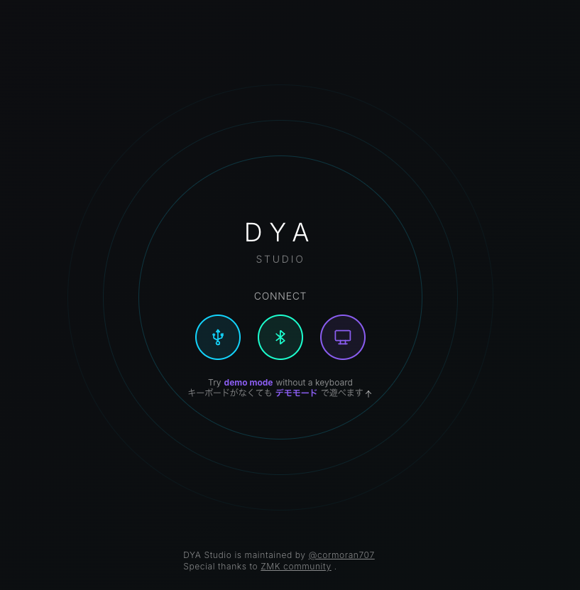
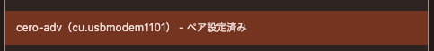
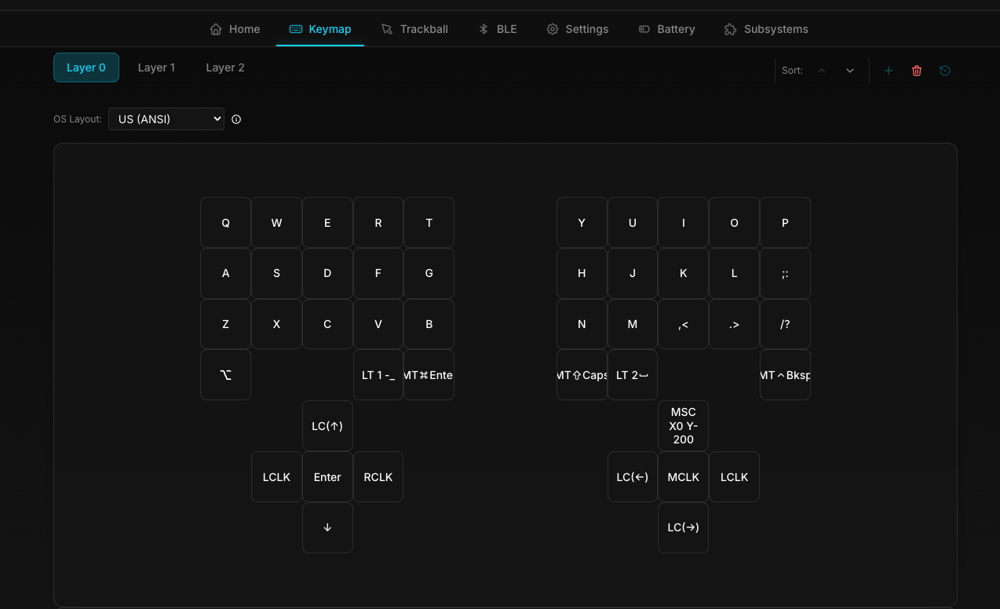
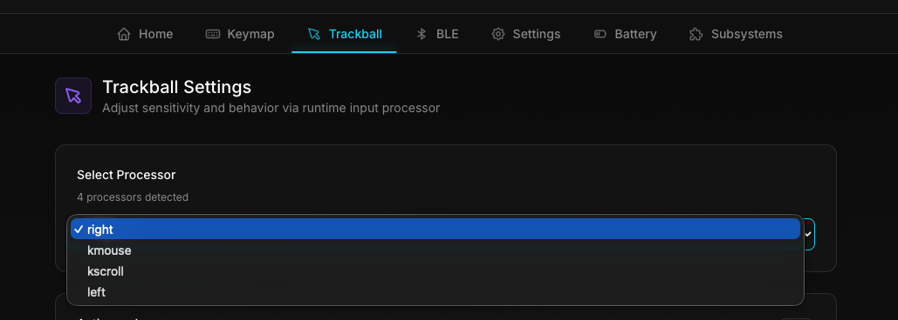

# CERO/ADV セットアップガイド

TECLA-CERO/Adv（dya studio 対応版）の組み立て後セットアップ手順です。

- ファームウェアの書き込み（左右両方）
- DYA STUDIO への接続
- キーマップ / トラックボールの調整

---

## 0. 必要なもの

- データ通信対応の USB ケーブル（充電専用ケーブルは不可）
- 単4電池など、左右それぞれの電源
- **WebSerial / WebBluetooth 対応ブラウザ**（Google Chrome / Microsoft Edge 推奨。Safari は非対応）

---

## 1. ファームウェアを書き込む

左右それぞれに、対応するファームウェア（uf2）を書き込みます。**左右は別々のファームウェア**です。

### 1-1. 書き込みモードにする

1. スイッチを **OFF**（電池とは逆側の位置）にする
2. BMP を USB ケーブルで PC に接続する
3. `BLEMICROPRO` という名前のストレージがマウントされる
4. 中身に `INFO_UF2.TXT` があることを確認する

### 1-2. どの uf2 を選ぶか

[Releases](https://github.com/nktn/zmk-keyboard-tecla-cero-adv/releases) から uf2 をダウンロードします。**右側＝central、左側＝peripheral** を書き込みます。ミニトラックパッド（Extender-Mini）の有無で `with` / `no` を選び、**左右で揃えて**ください。

| 書き込む側 | ファイル名 | ミニトラックパッド |
|---|---|---|
| 右（central） | `tecla_cero_right_central_with_trackpad` | あり |
| 右（central） | `tecla_cero_right_central_no_trackpad` | なし |
| 左（peripheral） | `tecla_cero_left_peripheral_with_trackpad` | あり |
| 左（peripheral） | `tecla_cero_left_peripheral_no_trackpad` | なし |
| （リセット用） | `settings_reset` | 設定初期化・ペアリング解除に使用 |

> ミニトラックパッドを使わない場合は `no_trackpad` を選びます。左右でトラックボールはどちらの構成でも有効です。

### 1-3. 書き込む

1. uf2 を 1 つ選んで `BLEMICROPRO` ストレージにコピーする
2. 書き込みが完了するとストレージが自動的に切断される
3. USB ケーブルを抜く
4. もう一方の側も同様に、対応する uf2 を書き込む
5. 左右ともスイッチを **ON** にすると動作します

> **左右のペアリング**は初回起動時に自動で行われます。両方を ON にしてしばらく待つと接続されます。うまく繋がらない場合は「トラブルシューティング」を参照してください。

---

## 2. DYA STUDIO に接続する

キーマップやトラックボールの調整は [DYA STUDIO](https://studio.dya.cormoran.works/) から行います。USB 接続・Bluetooth 接続のどちらでもセットアップできます。

**左右が接続された状態**でアクセスしてください。

### USB 接続の場合

右側がセントラルなので、**USB は右側に挿し、左側は電池で無線通信できている状態**にします。

- 右：スイッチ ON で PC と USB 接続
- 左：電池でスイッチ ON（右と無線接続済み）

その状態で DYA STUDIO を開き、`Connect` →`USB` を選択し、ポップアップから `cero adv` を選択してください。

### Bluetooth 接続の場合

1. キーボード（右側）を PC と Bluetooth ペアリングしておく
2. DYA STUDIO で `Connect` → `Bluetooth` を選び、`cero adv` を選択する

---

## 3. キーマップを変更する

レイヤーごとに各キーへ動作を割り当てられます。編集後は **保存（Save）操作で本体に書き込む**のを忘れないでください。

---

## 4. トラックボール / ポインタを調整する

`Select processor` で調整対象を選びます。

| 表示 | 対象 | 内容 |
|---|---|---|
| `right` | 右トラックボール | カーソル移動（反転・スクロール化・速度） |
| `left` | 左トラックボール | スクロール |
| `kmouse` | **キー（5方向タクト等）由来のマウス移動**の速度 | トラックボール本体ではない |
| `kscroll` | **キー（5方向タクト等）由来のスクロール**の速度 | トラックボール本体ではない |

- デフォルトは **右側＝カーソル移動 / 左側＝スクロール**です。
- `kmouse` / `kscroll` はトラックボールそのものではなく、5方向タクトスイッチやマクロで発生するマウス/スクロール動作の速度調整です。

---

## トラブルシューティング

- **`BLEMICROPRO` がマウントされない**：USB ケーブルがデータ通信対応か確認。スイッチが OFF になっていないか確認。
- **左右が繋がらない / 片側が反応しない**：左右両方に `settings_reset` を書き込んでから、改めて通常ファームウェアを書き込み、両方を ON にして再ペアリングする。
- **DYA STUDIO でデバイスが選べない**：Chrome / Edge を使っているか確認（Safari 不可）。USB の場合は右側を接続しているか確認。
- **編集が反映されない**：DYA STUDIO で保存（Save）したか確認。
